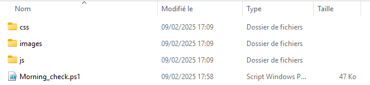
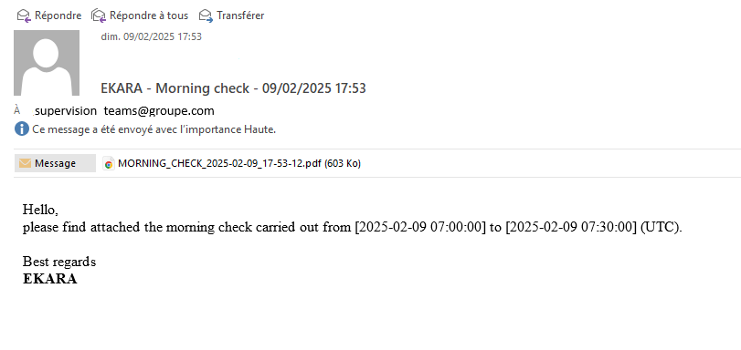
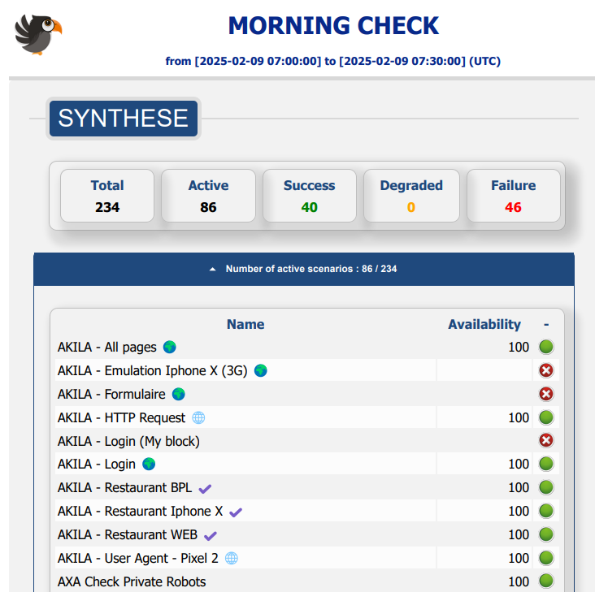

# Ekara-Morning_Check

<a href="https://api.ekara.ip-label.net/"> 

## Description
This [Powershell](https://learn.microsoft.com/powershell/scripting/overview) Checks the status of the [Ekara](https://ekara.ip-label.net/) scenarios over the defined period and sends an email with a report in PDF format, as an attachment.
You can automate this script into a scheduled task to send a daily report, before service opening.

For this, the script uses the Rest [Ekara](https://api.ekara.ip-label.net/) API.

## Prerequisites
Components|version
--|:--:
Ekara plateform|>=24.12
PowerShell|>=5
.NET|>=4
Microsoft EDGE
folders CSS - images - JS

## Download
[github-download]: https://github.com/MrGuyTwo/Ekara-Morning_Check/releases
 - [`Ekara-Morning_Check`][github-download]

## Installation
Unzip the archive [Morning_Check.zip]

## Configuration
Before using the script [Morning_check.ps1], you need to edit it to configure the settings.

Variables|Descriptions
--|:--:
$UserName|Account Ekara
$PlainPassword|Password Ekara
$SmtpServer|SMTP Relay Address
$SmtpPort|SMTP Relay Port
$Smtpemail|Email account
$SmtpPass|Email password
$MailRecipients|List of recipients
$localDateDebut|Start of the controlled period
$localDateFin|End of controlled period

## Using script
When the script is configured, you can automate it with a scheduled task so that the report is sent automatically.
The script:
- Performs an inventory of Ekara scenarios (status and availability) over the defined period.
- Generates an HTML file.
- Generates a PDF file using Edge's print function.
- Sends an email with the PDF file attached.

## The main function
To inventory the scenarios, the script uses the Ekara API. 

- auth/login
- adm-api/scenarios
- results-api/availability

## Screens
Email example :

Report example  :

